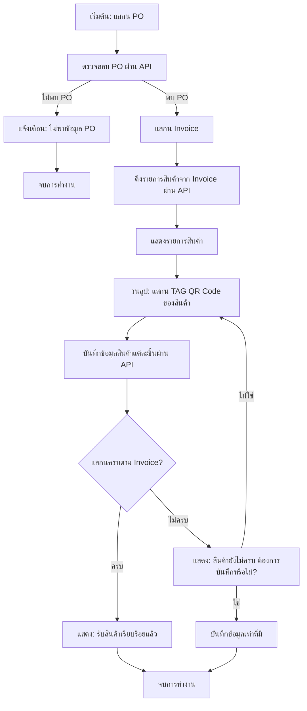

# 📦 ระบบแสกนรับสินค้าเข้าคลัง (Inbound Scan System)

ระบบนี้ถูกออกแบบมาเพื่อให้พนักงานสามารถรับสินค้าเข้าคลังได้อย่างมีประสิทธิภาพ โดยใช้การแสกน PO, Invoice และ QR Code ของสินค้า พร้อมเชื่อมต่อ API เพื่อตรวจสอบและบันทึกข้อมูลแบบเรียลไทม์

---

## 🚀 คุณสมบัติหลัก

-   แสกน PO และตรวจสอบข้อมูลผ่าน API
-   แสกน Invoice และแสดงรายการสินค้า
-   แสกน QR Code ของสินค้าแต่ละชิ้น
-   บันทึกข้อมูลการรับเข้าสินค้าแบบอัตโนมัติ
-   แจ้งเตือนหากข้อมูลไม่ครบถ้วนหรือไม่พบรายการ
-   รองรับการบันทึกแบบบางส่วนในกรณีที่สินค้าไม่ครบ

---

## 📋 ขั้นตอนการทำงาน

### 1. แสกน PO

-   พนักงานทำการแสกนรหัส **PO (Purchase Order)** ผ่านอุปกรณ์ Mobile/Scanner
-   ระบบจะส่งข้อมูลไปตรวจสอบกับ API:
    -   ✅ **หากพบ PO** → ดำเนินการต่อ
    -   ❌ **หากไม่พบ** → แจ้งเตือน: `ไม่พบข้อมูล PO นี้ในระบบ` และหยุดการทำงาน

---

### 2. แสกน Invoice

-   หลังพบ PO แล้ว พนักงานจะต้องแสกน **Invoice Number**
-   ระบบจะเรียก API เพื่อดึง **รายการสินค้าที่อยู่ใน Invoice**

---

### 3. แสดงรายการสินค้า

ระบบจะแสดงข้อมูลสินค้าทั้งหมดจาก Invoice:

-   รหัสสินค้า (Item Code)
-   ชื่อสินค้า (Description)
-   จำนวนที่ต้องรับ (Quantity)

---

### 4. แสกน TAG QR Code ของสินค้า

พนักงานทำการแสกน QR Code ของสินค้าแต่ละชิ้น โดยระบบจะ:

-   ตรวจสอบความถูกต้องของ QR Code
-   เรียก API เพื่อบันทึกการรับสินค้าแบบเรียลไทม์

---

### 5. ตรวจสอบความครบถ้วน

ระบบจะตรวจสอบว่า:

-   ✅ หาก **แสกนครบตามจำนวนใน Invoice**:
    -   แสดงข้อความ: `รับสินค้าเรียบร้อยแล้ว`
    -   ทำการปิดงาน
-   ⚠️ หาก **ยังไม่ครบ**:
    -   แสดงข้อความแจ้งเตือน:
        > "สินค้ายังไม่ครบตาม Invoice ต้องการบันทึกข้อมูลหรือไม่?"
    -   หากผู้ใช้เลือก:
        -   ✔️ **ใช่** → บันทึกข้อมูลเท่าที่มี และจบกระบวนการ
        -   ❌ **ไม่ใช่** → กลับไปสแกนสินค้าเพิ่มเติม

---

## 🔄 Flow Diagram

